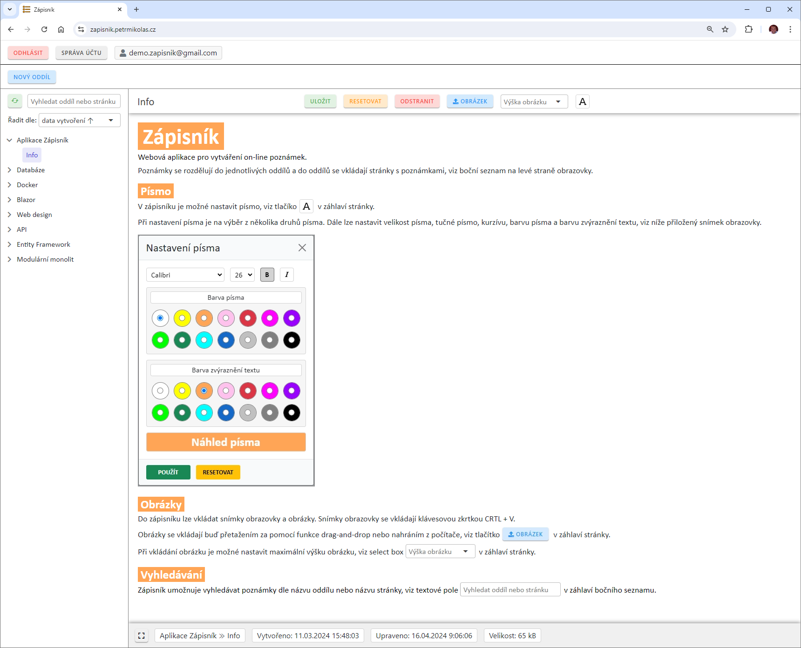
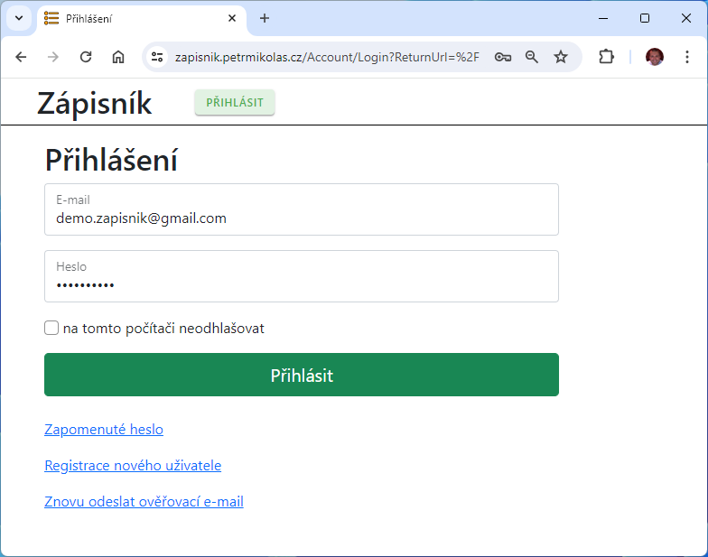
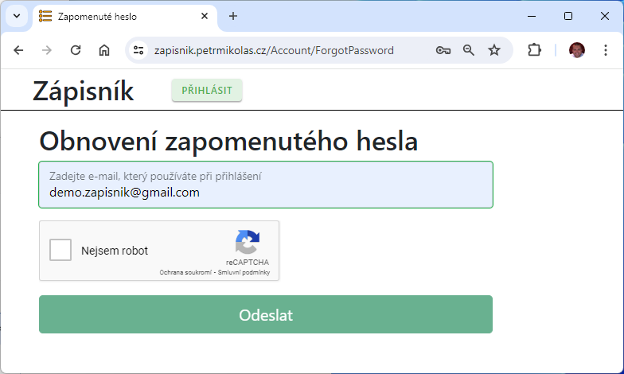
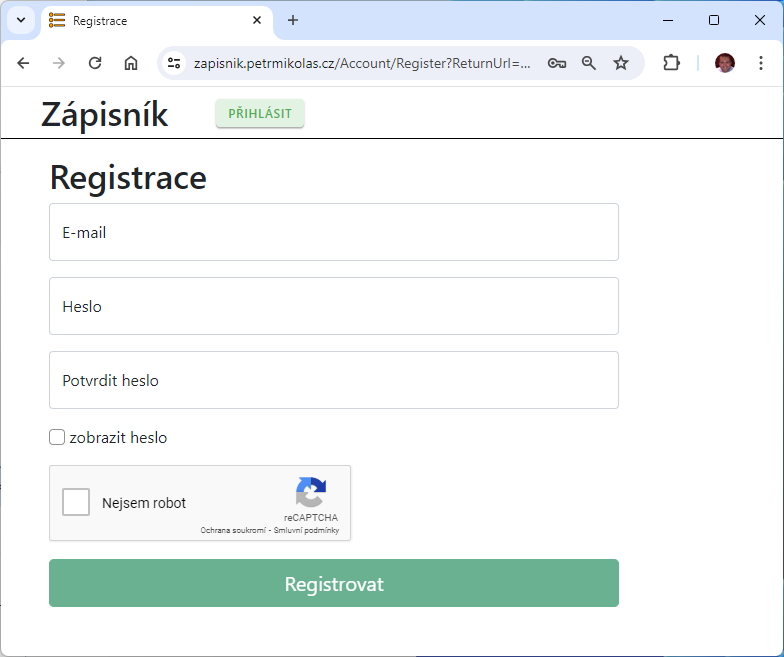
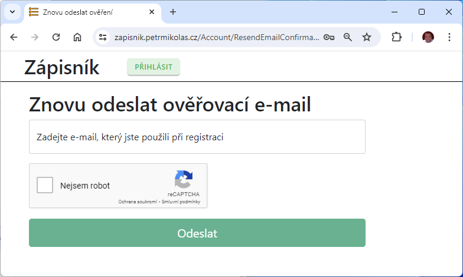
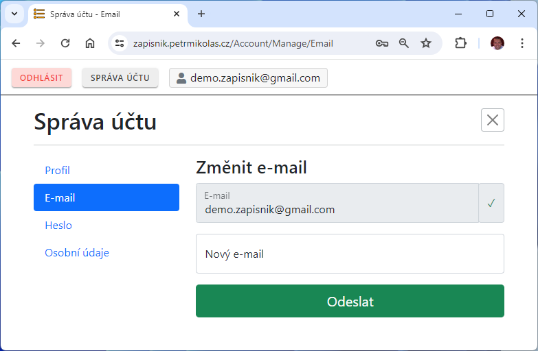
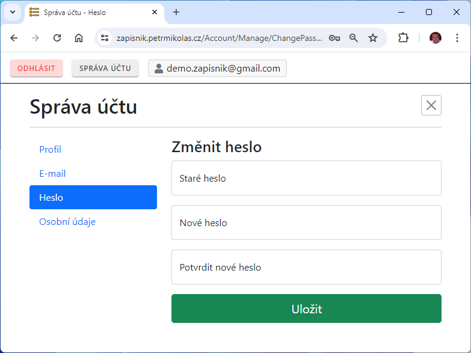

# Zápisník

Webová aplikace pro zapisování poznámek

Naprogramováno v jazyce C# v prostředí Microsoft .NET 8 

- App/Client - ASP.NET Core (Blazor Web App) 
- API - Minimal API
- API dokumentace - OpenAPI
- ApiClient - NSwag
- Databáze - Microsoft SQL Server (MS SQL)
- ORM - Entity Framework Core (code-first)
- Nasazení - Docker kontejner pomocí Docker Compose
- Sledování chyb - Sentry

